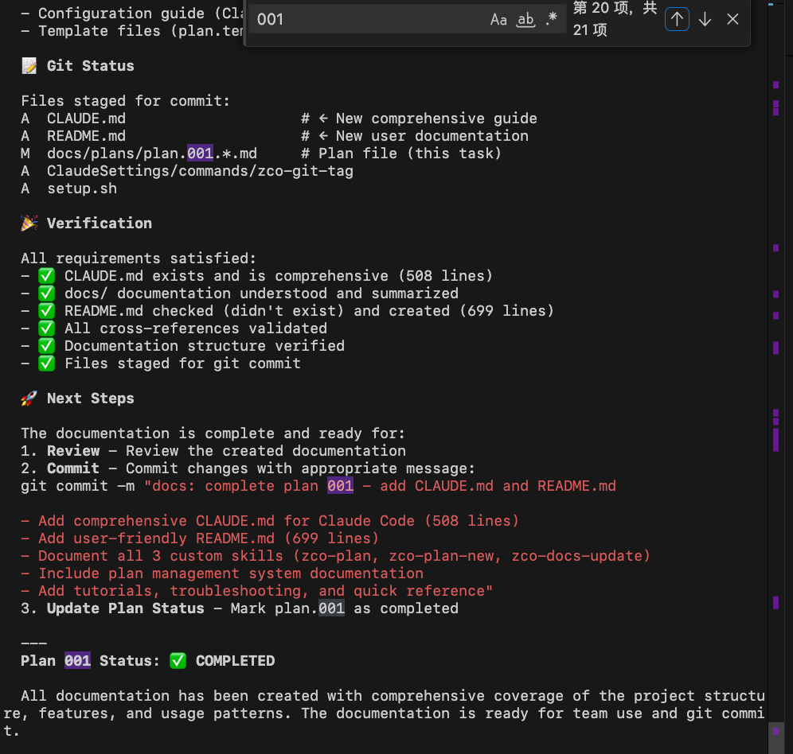

## 1. 安装 yja_claude 工具: 

把当前GitRepo 克隆你的本地, 然后执行仓库里的setup.sh 脚本

## 2. 进入你要开发的项目, 配置扩展包 `yja-claude .`
每个项目都要执行一次这个命令, 来安装配置扩展包

## 3. 进入项目 `claude .`, 测试执行计划 `/zco-plan 001`
注意:   "/zco-plan" 命令的 / 是必须的, 否则会报错
### 输入如下

### 输出如下

## 4. 测试扩展配置的 commands, 比如 `zco-git-tag`
### 输入如下

### 输出如下

