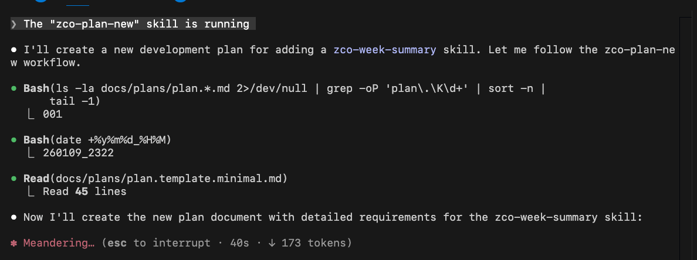
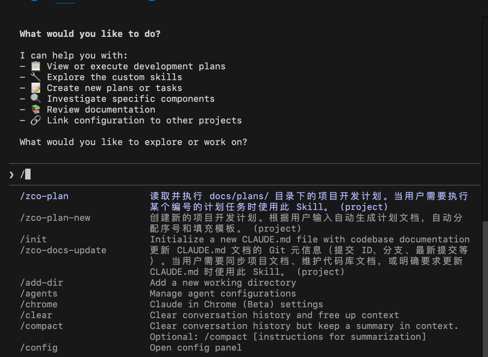
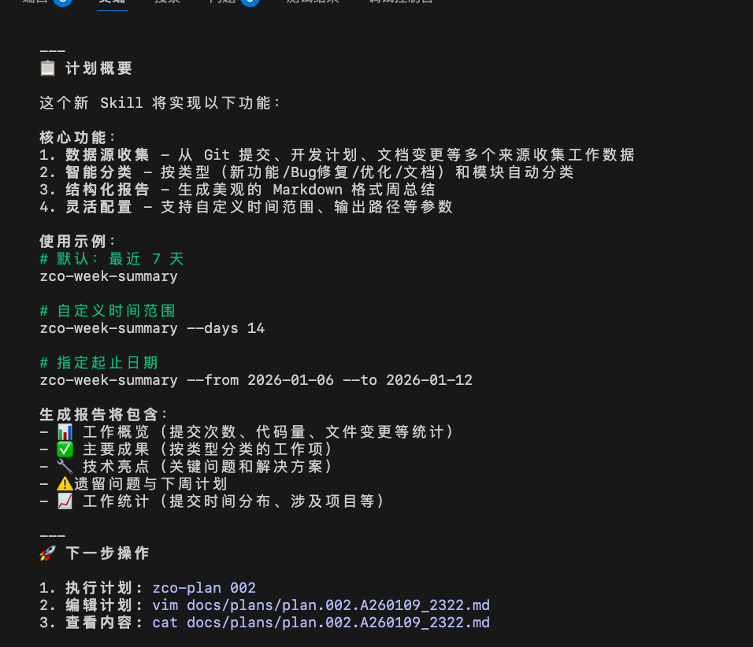

# ClaudeSettings 配置扩展包

## zco-plan 工作流程

### 0. 准备工作

- 安装 claude
- 安装 python3 > 3.10

### 1. 安装 yja_claude 工具: `./setup.sh`
把当前GitRepo 克隆你的本地, 然后执行仓库里的setup.sh 脚本

### 2. 进入你要开发的项目, 配置扩展包 `yja-claude .`
每个项目都要执行一次这个命令, 来安装配置扩展包

### 3. 进入项目 `claude .`

### 4. 测试执行计划 `/zco-plan 001`
注意:   "/zco-plan" 命令的 / 是必须的, 否则会报错

- 输入如下

- 输出如下

### 5. 测试新建计划, 比如 `/zco-plan-new 新增一个ClaudeSkill: zco-week-summary, 用于对最近一周的工作进行总结`

- 输入如下

 

- 输出如下

参考: [002.A260109_2322.md](./docs/plans/plan.002.A260109_2322.md)

- 你可以 对 新建的计划 进行评审和修改, 然后再执行它 `/zco-plan 002`, 进行下一轮迭代
  

